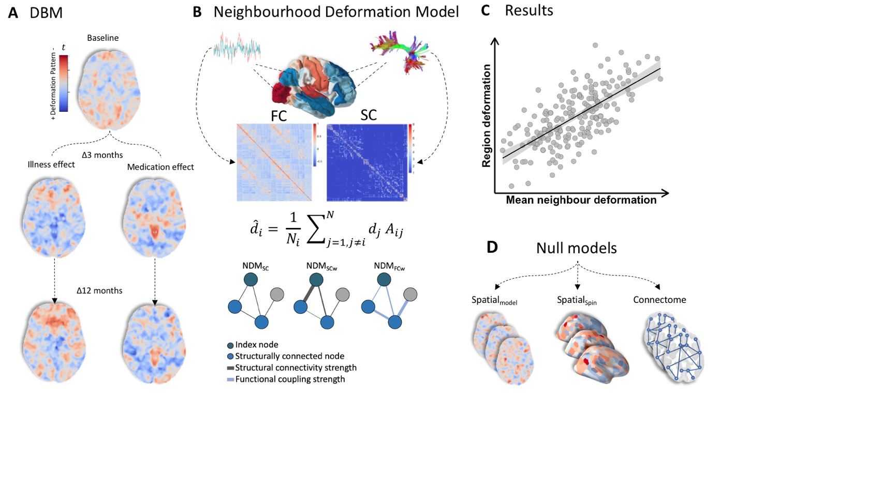
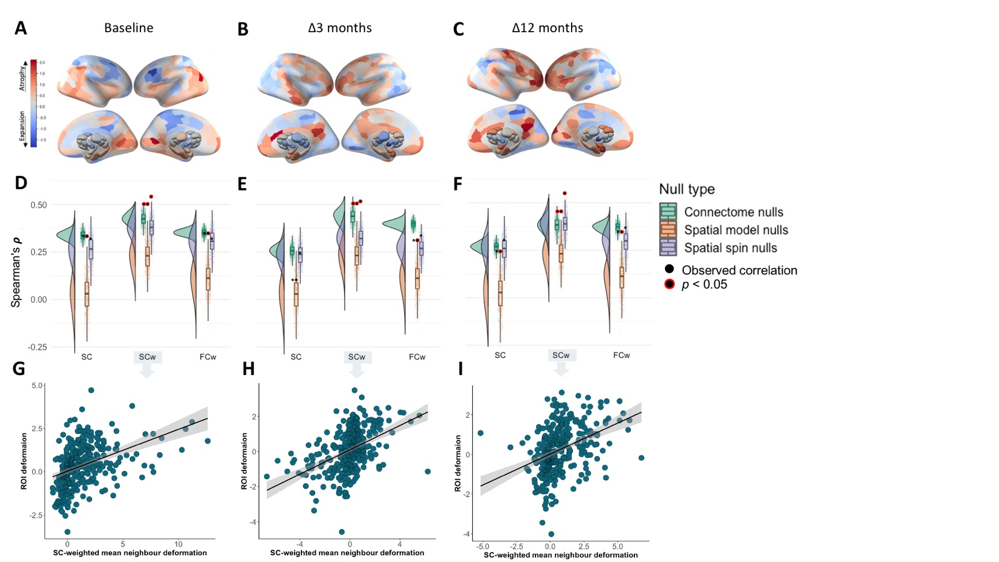
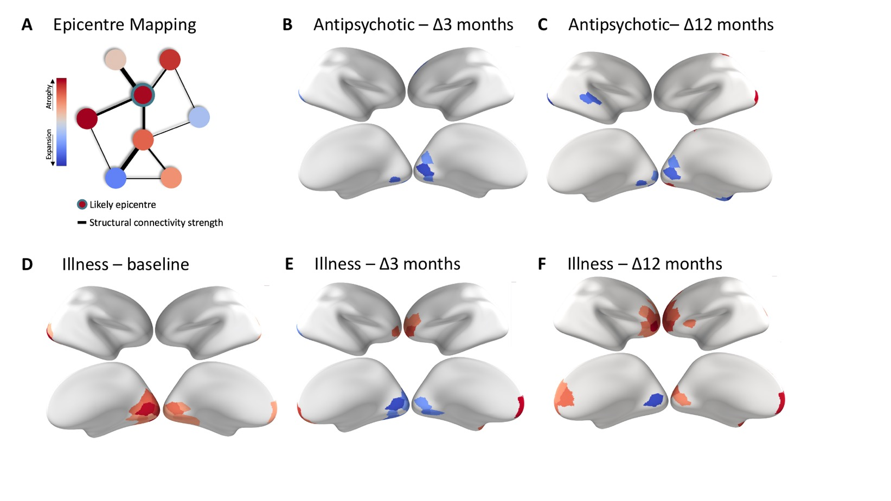

Network Constraints on Longitudinal Grey Matter Changes in Psychosis
================

## Reference

Chopra, S., Oldham, S., Segal, A., Holmes, A., Sabaroedin, K., Orchard,
E. R., … & Fornito, A. (2022). [Network constraints on longitudinal grey
matter changes in first episode
psychosis](https://www.medrxiv.org/content/10.1101/2022.01.11.22268989v3).
medRxiv.

------------------------------------------------------------------------

## Background

Different regions of the brain’s grey matter are connected by a complex
structural network of white matter fibres, which are responsible for the
propagation of action potentials and the transport of trophic and other
molecules. In neurodegenerative disease, these connections constrain the
way in which grey matter volume loss progresses. Here, we investigated
whether connectome architecture also shapes the spatial pattern of
longitudinal grey matter volume changes attributable to illness and
antipsychotic medication in psychosis.

------------------------------------------------------------------------

## Code and Data release

The `scripts` folder contains the three primary analysis and
visualisation scripts:

-   `runNDM.R` begins with a function which takes in a vector of volume
    change values (or any statistic) for each region, a structural
    connectivity (SC) matrix, optionally a functional connectivity (FC)
    matrix and applies the Network Deformation Model (NDM). The function
    allows the model to optionally be unweighted or weighted by SC or
    FC. The function also computes p-values based on the three different
    null models (connectome, spin and parameterised nulls).  

-   `plotNDM.R` script takes the output of `runNDM.R` function (a .RDS
    file) and plots the results like below:  

-   `runNDMepicenter.R` runs the epicenter analysis using the same
    inputs as `runNDM.R` and plots the results.  

The `functions` folder contains a collection of helper functions for the
primary analysis and visualization scripts. The majority of the
functions are used to generate group-level FC/SC matrices and do not
need to be rerun as the outputs are provided in the contents data folder
described below.

The `data` folder contains:

-   The representative group consensus SC and group mean FC matrices for
    healthy control data sets. The SC data was processed using
    tractoflow and filtered using COMMIT2 (please refer to paper for
    details). The FC data was processed using fmriprep and denoised
    using AROMA, with and without Global Signal Regression (please refer
    to paper for details).

-   The Deformation Based Morphometry (DBM) voxel-level contrast
    t-statistic maps for all contrasts. HC = Healthy control, PIPT =
    Placebo group and MIPT = Medication group. (please refer to paper
    for details on processing).

-   The atlases used (Schaefer 300 parcel, 7 network and Tian/Melbourne
    atlas subcortical scale 2) for volume, SC and FC estimates.

Note: Due to data space restrictions the generated nulls are not
included in this repository.

------------------------------------------------------------------------

## Questions

Please contact me (Sidhant Chopra) as <sidhant.chopra@yale.edu> and/or
<sidhant.chopra4@gmail.com>
